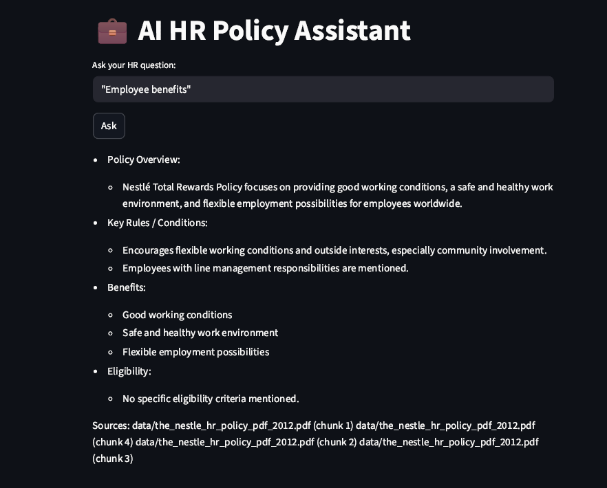

🧠 AI HR Policy Assistant (RAG System)
🚀 Overview

This project is a Retrieval-Augmented Generation (RAG) system that answers HR-related queries based on a company policy document.

It uses:

LangChain
OpenAI embeddings + LLM
ChromaDB (vector database)
Streamlit UI

🎯 Key Features

Ask natural language HR questions
Retrieves relevant policy sections
Generates structured answers
Displays source references (traceability)
Handles missing information gracefully

🏗️ Architecture

User Query
   ↓
Retriever (ChromaDB)
   ↓
Relevant Chunks
   ↓
LLM (OpenAI)
   ↓
Structured Answer + Sources

📊 Example Queries

"What are employee benefits?"
"Explain leave policy"
"What rewards does the company provide?"

⚠️ Limitation

This system strictly answers based on the provided document.

If a policy detail is not present (e.g., detailed maternity rules),
the system will indicate that the information is not available.

🛠️ Tech Stack

Python
LangChain
OpenAI API
ChromaDB
Streamlit

⚙️ Setup Instructions

git clone <your-repo>
cd genai-hr-assistant

pip install -r requirements.txt

Create .env file:

OPENAI_API_KEY=your_api_key_here

Run app:

streamlit run app.py

📌 Future Improvements

Add multiple HR documents
Chat memory (multi-turn conversation)
Better UI (chat-style interface)
Deployment (Streamlit Cloud)

